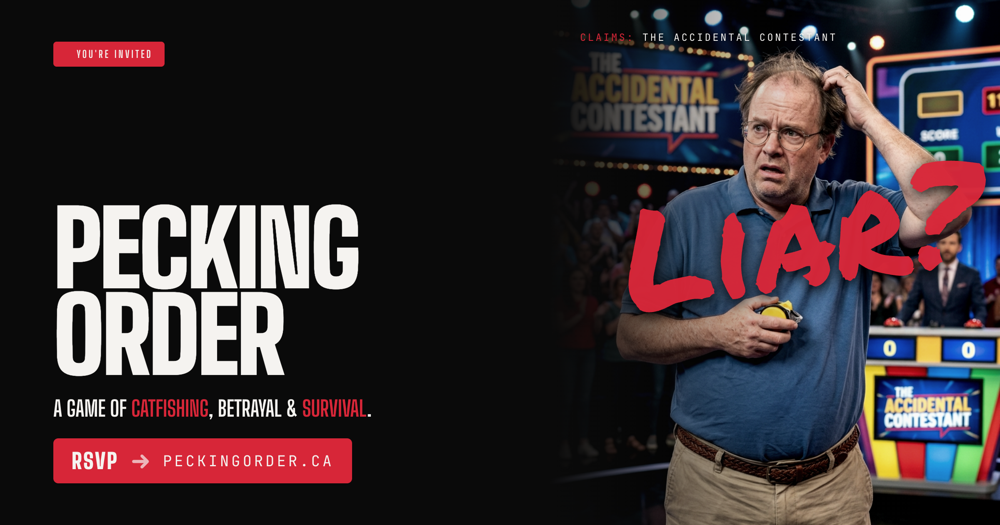
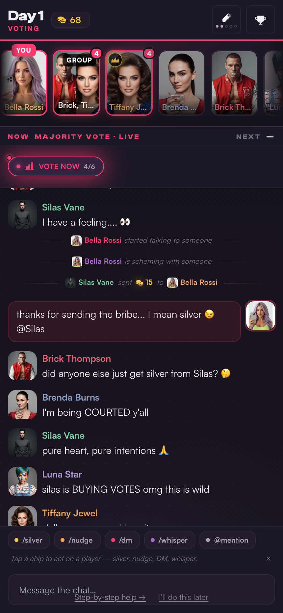
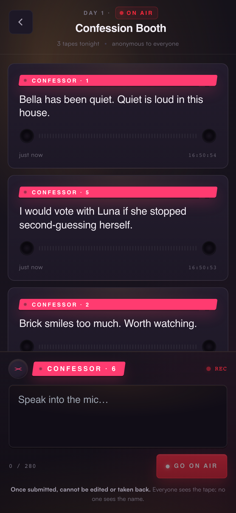

  

<h1 align="center">Pecking Order</h1>

  A persistent, multi-day social-deduction game you play on your phone, a few minutes a day. 
  Think <em>The Traitors</em>, except you're in the cast.

  <strong>Prototype · solo-built · playtest stage</strong>

---

This repository is the working prototype for Pecking Order, a real-time social game I designed and built end to end. I'm sharing it as a portfolio piece, so this README explains **what the system is and the thinking behind how it's built**, not how to install it. It isn't meant to be stood up by anyone else.

The short version: a game that has to keep running whether or not anyone is watching it. That one requirement is what makes the engineering interesting. A multi-day story that advances on its own schedule, holds secret per-player state, and survives players dropping in and out. The rest of this document is about how I made that hold together.

## What it is

Six to twenty players get dropped into a cast together for a multi-day game. The design target is a seven-day arc. Each day runs on a server-driven timeline with its own phases: open chat, private DMs and alliances, a daily activity, a vote. Someone gets eliminated. The next day picks up wherever the social fallout left off.

It's async by design. The game advances on its own clock, so players check in for five or ten minutes when they have a moment, not at a fixed time. It's phone-first, a PWA you join from a magic link, no app store and no password. Players get handed fictional personas with portraits and bios, and the whole thing is dressed in a reality-TV skin, down to an in-game "Production" voice that narrates the drama.

<table>
  <tr>
    <td width="33%"></td>
    <td width="33%"></td>
    <td width="33%"></td>
  </tr>
  <tr>
    <td align="center">Live voting, with a silver economy you can spend on bribes</td>
    <td align="center">The Confession Booth — anonymous, to-camera asides</td>
    <td align="center">Every day, the cast votes someone out</td>
  </tr>
</table>

## Why it's an interesting system

The hard part of Pecking Order isn't any one screen. It's that the game is a **stateful, long-lived process** with three properties that fight each other:

- **It's persistent and self-advancing.** Days and phases turn over on a schedule, on the server, even when no one is connected. The game is never "paused waiting for input."
- **It's secret-keeping.** No two players are allowed to see the same thing. Hidden votes, private DM threads, anonymous confessions, who-submitted-but-not-what: the server has to decide, per player, what's true *for them* on every update.
- **It's a moving target.** Twenty cartridge-style activities, four visual themes, a live social layer, an economy, and an admin console all have to compose without turning into a tangle.

Here are the decisions I'd actually walk someone through.

**One Durable Object per game as the unit of consistency.** Each game is a single Cloudflare Durable Object, a single-threaded, strongly-consistent actor that owns all of that game's state. That sidesteps the usual distributed-state and locking problems. There's one authority, its SQLite is the source of truth, and a separate D1 database holds the secondary cross-game record (rosters, journals, wallets) on fire-and-forget writes. When the two disagree, the DO wins. I decided that up front rather than discovering it in production.

**A nested hierarchy of state machines, the "Russian Doll."** The game logic is XState v5, decomposed into layers that each do one job and forward events explicitly downward. A connection layer owns the socket, identity, and routing. An orchestrator owns the day/phase loop, the fact log, and scheduling. A session owns the live social layer, split into parallel regions for chat, voting, activities, and dilemmas. Each activity is a **cartridge**, a child machine spawned on demand. Cartridges never get killed. They're told to wrap up, compute a result, reach a final state, and report upward. That termination protocol is the contract that keeps the whole thing composable, and it's the rule I most often have to stop myself from breaking.

**Event-sourced "facts" as the backbone.** State changes get recorded as an append-only log of facts that flow up from cartridges and fan out to side effects: the journal, the on-screen ticker, push notifications. The system gets an audit trail for free, and outbound effects all happen at one well-defined seam instead of scattered across the codebase.

**Per-player projections, computed on every transition.** Every state change re-broadcasts a *different*, filtered payload to each connected player. Chat is filtered to the channels you're in, hidden answers are stripped, author identities are masked during confession and guess-who phases. Clients hold no secret state of their own. They render what the server decides they're allowed to know. That's a correctness and trust boundary, not a feature: a client can't leak what it was never sent.

**Pure machines, with the environment injected at the edge.** The state machines are pure and do no I/O. The Durable Object's runtime, its database handle, network, and deferred work, gets injected at startup through a small set of overridable actions. The payoff is that the entire game brain is unit-testable without standing up any infrastructure. That's most of why there are ~70 test files here instead of a manual QA spreadsheet.

**A scheduler bolted onto Durable Object alarms.** The timeline advances on DO alarms. The day model uses "anchor to now" resolution: the day index decides *what* content plays, the wall clock decides *when* its events fire. There's a documented workaround in here for a genuinely nasty alarm-versus-constructor race, the kind of thing you only find by living in the platform for a while.

If you want the real depth, [`ARCHITECTURE.md`](ARCHITECTURE.md) traces the actual data flows: the event-routing path, the fact fan-out, the sync broadcast, the alarm pipeline. [`plans/DECISIONS.md`](plans/DECISIONS.md) is the decision log, 151 ADRs and counting.

## How it's built

A Turborepo monorepo: five apps, five shared packages.

| Path | What it is |
| --- | --- |
| `apps/game-server` | The engine. Cloudflare Worker plus Durable Object holding the nested XState machines and cartridges. |
| `apps/client` | Player client. React 19 plus Vite PWA, with four interchangeable visual "shells." |
| `apps/lobby` | Next.js 15 (on Cloudflare via OpenNext). Game creation, magic-link invites, admin dashboard. |
| `apps/nudge-worker` | Push-notification delivery worker. |
| `apps/sentry-tunnel` | Error-reporting proxy. |
| `packages/shared-types` | The source of truth: event constants, Zod schemas, manifest types. Everything imports from here. |
| `packages/cartridges` | Voting, prompt, and dilemma machines. |
| `packages/game-cartridges` | Game machines (arcade, trivia, sync-decision) and the arcade factory. |
| `packages/auth` | JWT issuing and verification (jose). |
| `packages/ui-kit` | Tailwind preset and theme tokens. |

**Stack:** TypeScript everywhere. Cloudflare Workers / Durable Objects (PartyServer), XState v5, React 19, Next.js 15, D1 (SQLite), R2, Zustand, Tailwind, Framer Motion. Tested with Vitest for unit work and Playwright across nine end-to-end suites.

## How I built it

A system this size, built solo, only works if you treat the *development process itself* as something to engineer. The repo includes the tooling I built to do that. I've left it in deliberately, because it's part of the work.

The center of it is a **self-learning agent workflow**, written up in [`.claude/guardrails/INTENT.md`](.claude/guardrails/INTENT.md). The problem it solves is mundane and real: across a long-running project, hard-won knowledge kept dying between work sessions, and passive documentation got read once and ignored. More docs don't fix that. Three layers do, by putting the right knowledge in front of you at the moment you need it.

- **Active enforcement.** A hook scans a set of narrow rule files and surfaces the relevant one right when you're about to repeat a known mistake. There are 62 of these rules. Just as important, there's a discipline for *retiring* them, because every rule costs attention forever. Adding one requires a kill condition. A periodic pass prunes the dead ones.
- **Hierarchical context.** Conventions live next to the code they govern, so working in one app surfaces that app's rules and not the noise from everywhere else.
- **A learning loop.** A reflection step at the end of a session captures genuinely new lessons and turns them into the next session's guardrails.

Alongside it: 151 architecture decision records, a spec treated as the source of truth, and a commit history that runs to roughly 1,300 commits. The point isn't the AI. It's that the practice is deliberate, legible, and built to keep a large codebase coherent over months.

## Running it

This isn't packaged for outside use, but it does run. With dependencies installed, `npm run dev` brings up all three surfaces through Turborepo: lobby on `:3000`, client on `:5173`, game server on `:8787`. Conventions and the deeper map live in [`CLAUDE.md`](CLAUDE.md).

## Status & further reading

Pecking Order is an active prototype at the playtest stage. Several real playtests have run. It's pre-monetization and not production-hardened. It's a real product effort, and also the most complete picture I have of how I think about building systems.

- [`ARCHITECTURE.md`](ARCHITECTURE.md) — data flows, module relationships, the implicit contracts
- [`plans/DECISIONS.md`](plans/DECISIONS.md) — the ADR log (151 decisions)
- [`spec/`](spec/) — the technical specification (source of truth)
- [`.claude/guardrails/INTENT.md`](.claude/guardrails/INTENT.md) — the development-practice writeup
- [`CLAUDE.md`](CLAUDE.md) — working conventions
